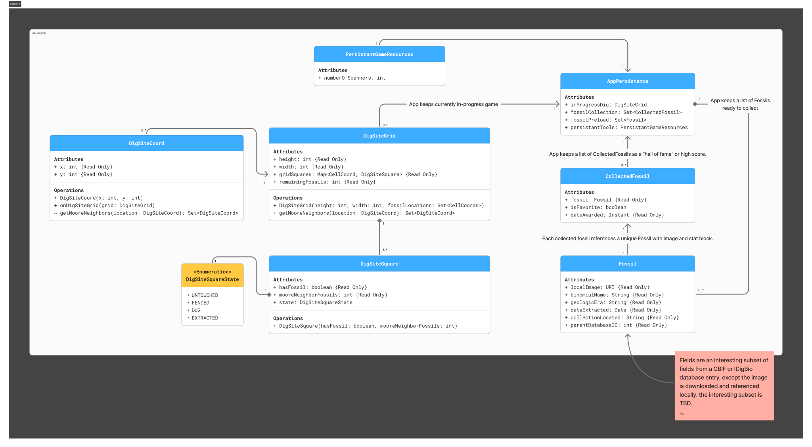



## Page contents
{:.no_toc:}

- ToC
{:toc}

## UML class diagram

## Entity-relationship diagram

### Entity Classes
[Fossil](https://github.com/dd-java-22/fossil-sweeper-GilesVolmir/blob/main/app/src/main/java/edu/cnm/deepdive/fossilsweeper/model/entity/Fossil.java)

[CollectedFossil](https://github.com/dd-java-22/fossil-sweeper-GilesVolmir/blob/main/app/src/main/java/edu/cnm/deepdive/fossilsweeper/model/entity/CollectedFossil.java)

[UserProfile](https://github.com/dd-java-22/fossil-sweeper-GilesVolmir/blob/main/app/src/main/java/edu/cnm/deepdive/fossilsweeper/model/entity/UserProfile.java)

[DigSiteGrid](https://github.com/dd-java-22/fossil-sweeper-GilesVolmir/blob/main/app/src/main/java/edu/cnm/deepdive/fossilsweeper/model/entity/DigSiteGrid.java)

[DigSiteSquare](https://github.com/dd-java-22/fossil-sweeper-GilesVolmir/blob/main/app/src/main/java/edu/cnm/deepdive/fossilsweeper/model/entity/DigSiteSquare.java)

