

### Entity Relationship Diagram

This diagram illustrates the relationships between the persistent model classes in our application. It provides a visual representation of how data is interconnected and how different entities interact with each other.

### Entity Classes

The following entity classes define the persistent data model for our application:

[Fossil](https://github.com/dd-java-22/fossil-sweeper-GilesVolmir/blob/main/app/src/main/java/edu/cnm/deepdive/fossilsweeper/model/entity/Fossil.java)

[CollectedFossil](https://github.com/dd-java-22/fossil-sweeper-GilesVolmir/blob/main/app/src/main/java/edu/cnm/deepdive/fossilsweeper/model/entity/Fossil.java)

[UserProfile](https://github.com/dd-java-22/fossil-sweeper-GilesVolmir/blob/main/app/src/main/java/edu/cnm/deepdive/fossilsweeper/model/entity/UserProfile.java)

[DigSiteGrid](https://github.com/dd-java-22/fossil-sweeper-GilesVolmir/blob/main/app/src/main/java/edu/cnm/deepdive/fossilsweeper/model/entity/DigSiteGrid.java)

[DigSiteSquare](https://github.com/dd-java-22/fossil-sweeper-GilesVolmir/blob/main/app/src/main/java/edu/cnm/deepdive/fossilsweeper/model/entity/DigSiteSquare.java)

### Database Class

The Database class shown here is the way we create and access our database.

[FossilSweeperDatabase](https://github.com/dd-java-22/fossil-sweeper-GilesVolmir/blob/main/app/src/main/java/edu/cnm/deepdive/fossilsweeper/service/FossilSweeperDatabase.java)
